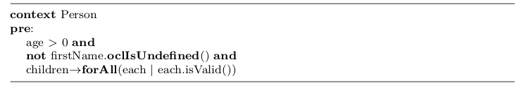

= science.sty

A simple LaTeX style package for writing scientific papers.

== Installation

[source,shell]
----
mkdir -p ~/Library/texmf/tex/latex/local
cd ~/Library/texmf/tex/latex/local
git clone git@gitlab.univ-nantes.fr:sunye-g/science.sty.git
texhash science.sty
----

== Abbreviations

The following LaTeX code:
[source,latex]
----
The work of Sigmund~\etal, \eg, ``Man and Father'' teach us the The Legend of a Conqueror, \ie, the ``Oedipus legend''.
In speaking of Oedipus ``legend'', I am following William Bascom,
who distinguishes between myth, legend, and folktale \wrt characters. (divine vs. human), time, setting,  \etc
----

Will produce:

== Listings package environments

=== OCL

The following LaTeX code:

[source,latex]
----
\begin{ocl}
context Person
pre: 
	age > 0 and 
	not firstName.oclIsUndefined() and
	children->forAll(each | each.isValid()|)
\end{ocl}
----

Will produce:

=== ATL

The following LaTeX code:

[source,latex]
----
\begin{atl}
rule relationnalContextToObjectContext {
	from
		r : RDBMSMM!RDBMSModel
	to
		c : ClassMM!ClassModel (
            classifier <- r.table->union(r.getAllDataTypes()->collect(dt | thisModule.typeToPrimitiveDataType(dt)))
		)
	do {
		r.debug('relationnalContextToObjectContext');
	}
}
\end{atl}
----

Will produce:

image::./img/atl.png[]